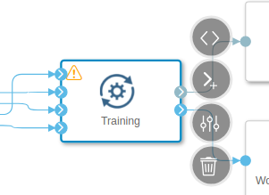

# GPU enablement for SDI on OCP

**Work in progress!!**

## Prerequisites

- OCP 4.6
- SAP Data Intelligence 3.1 or 3.2
- GPU equipped node(s)
    - make sure to use on of the support GPU model listed in the [SAP Note #2900587](https://launchpad.support.sap.com/#/notes/2900587)

## Node configuration

TODO

### Verification

- nodes are labeled by discovery pods with `nvidia.com/gpu.present=true`:

        # oc get nodes -l nvidia.com/gpu.present=true
        NAME       STATUS   ROLES        AGE    VERSION
        compute1   Ready    sdi,worker   364d   v1.19.0+b00ba52
        compute4   Ready    sdi,worker   342d   v1.19.0+b00ba52

- GPU operator installed and running on GPU enabled nodes, e.g.:

        # oc get pods -o wide -n gpu-operator-resources
        NAME                                       READY   STATUS      RESTARTS   AGE    IP            NODE       NOMINATED NODE   READINESS GATES
        gpu-feature-discovery-b45l7                1/1     Running     7          126d   10.129.4.21   compute4   <none>           <none>
        gpu-feature-discovery-xlcx9                1/1     Running     7          127d   10.130.2.9    compute1   <none>           <none>
        nvidia-container-toolkit-daemonset-8l29r   1/1     Running     0          126d   10.129.4.22   compute4   <none>           <none>
        nvidia-container-toolkit-daemonset-znhjv   1/1     Running     0          127d   10.130.2.3    compute1   <none>           <none>
        nvidia-dcgm-exporter-hwj7n                 1/1     Running     0          127d   10.130.2.11   compute1   <none>           <none>
        nvidia-dcgm-exporter-rltqr                 1/1     Running     0          126d   10.129.4.10   compute4   <none>           <none>
        nvidia-device-plugin-daemonset-ckbfb       1/1     Running     0          126d   10.129.4.20   compute4   <none>           <none>
        nvidia-device-plugin-daemonset-jdmb2       1/1     Running     0          127d   10.130.2.4    compute1   <none>           <none>
        nvidia-device-plugin-validation            0/1     Completed   0          72d    10.130.2.32   compute1   <none>           <none>
        nvidia-driver-daemonset-d4rzm              1/1     Running     0          26d    10.130.2.19   compute1   <none>           <none>
        nvidia-driver-daemonset-h88hn              1/1     Running     0          126d   10.129.4.8    compute4   <none>           <none>

## Configure a resource plan for GPU

### Get vctl binary

Follow [Download the SAP Data Intelligence System Management Command-Line Client Tool](https://help.sap.com/viewer/0b99871a1d994d2ea89598fe59d16cf9/3.1.latest/en-US/3de99bbe0c27487fb67f50dade7758c1.html).

### Configure resource plan

This examples assumes the commands are executed on a Linux managegement host where `jq` binary is installed.

1. Login to the Data Intelligence management service. In this example, for the API URL, we are using the URL of OpenShift's route:

        # # vctl login parameters: <vsystem-api-url> <tenant> <tenant-username>
        # ./vctl login https://vsystem-sdi.apps.<clustername>.<domainname>/ gpu-test miminar 
        Enter password: 
        Successfully logged in as "gpu-test/miminar"

2. List resource plans and store them in a json file:

        # ./vctl parameters get resourceplan.service.catalog | base64 -d | jq | tee resource-plans.orig.json
    
3. Choose one resource plan and extend it for GPU resource. In this example, we choose to modify the `advanced` resource plan.

    1. First set the desired arguments:

            # resourcePlanId=advanced
            # gpuLimit=1    # number of GPU units to request
            # nodeSelector=nvidia.com/gpu.present=true
            # # or alternatively to choose a specific GPU model:
            # nodeSelector=nvidia.com/gpu.present=true,nvidia.com/gpu.product=Tesla-V100-PCIE-32GB

    2. Then execute the following:

            # jq --arg resourcePlanId "$resourcePlanId" \
                 --arg nodeSelector "$nodeSelector" \
                 --arg gpuLimit "$gpuLimit" \
                '.resourcePlans |= [.[] |
                    if .resourcePlanId == $resourcePlanId then
                        . as $rp | [ $nodeSelector | split(",")[] |
                                     split("=") | {"key": .[0], "value": ((.[1] // "") | tostring)}
                                   ] | from_entries | . as $sel |
                        $rp | del(.nodeSelectors) |
                              .requestSpec.nodeSelectors |= $sel |
                              .requestSpec.gpu |= "" |
                              .limitSpec.gpu |= $gpuLimit
                    else
                        .
                    end
                ]' resource-plans.orig.json > resource-plans.new.json

    3. Please inspect the `resource-plans.new.json` and verify that it contains the desired nodeSelectors in the target resource plan, e.g.:

            # cat resource-plans.new.json
            ...
                {
                  "resourcePlanId": "advanced",
                  "resourcePlanDescription": "advanced",
                  "requestSpec": {
                    ...
                    "nodeSelectors": {
                        "nvidia.com/gpu.present": "true"
                    }
                  },
                  "limitSpec": {
                    ...
                  }
                }
            ...

    4. Optionally, modify the `requestSpec` and `limitSpec` `cpu` and `memory` attributes and save the file again.

    5. Update the resource plan in the SDI tenant:

              # ./vctl parameters set resourceplan.service.catalog "$(jq -c . resource-plans.new.json | base64 -w0)"

          Example output:

              Successfully set parameter "resourceplan.service.catalog" to "eyJyZXNvdXJj9...Cg=="

4. Start or re-start the Resource Plan Service.

    1. Go to the System Management, Applications tab.
    2. Find the "Resource Plan Service".
    3. If it is running, re-start it, otherwise start it.
    4. Ensure that the "started" notification appear or its status becomes "ready".

### Verify the GPU unit

1. Please download the [./graph.json](./graph.json) file.
2. Open Data Intelligence Modeler and click on the Import Graph icon . A new tab called "GPU usage test" will open.
3. Click on the "Training" operator and choose "Open Configuration".

    

    The "Open Configuration" icon: 

4. Choose your configured resource plan in the "Resource Plan" combobox.

    

5. Click "Save". In this example it is assumed the graph is named "GPU usage".
6. Open ML Scenario Manager, create or open a scenario.
7. In there, create a new pipeline from the "Blank" Template.

    

8. Back in the modeler, open the "GPU usage" graph and switch to JSON view.

    

9. Select the whole JSON content and copy it.

10. Return to the blank template tab opened from the Scenario Manager, switch to JSON view and paste the JSON content.
11. Save the graph and Run it.

## Troubleshooting

There are multiple pods generated for the pipeline. All but one have the nodeSelector unset, therefor running on any node. Only one of them - named by the hash, has the node selector set:

    # oc get pods -o wide | grep '098c58ec233d4c15bab2ac4508122b5f\|cbd6fc10-fb9a-4895-a897-b5115fa36c7e-s2qph'
    cbd6fc10-fb9a-4895-a897-b5115fa36c7e-s2qph                        0/2     Pending            0          23h     <none>         <none>     <none>           <none>
    vflow-bus-098c58ec233d4c15bab2ac4508122b5f-ssb4d                  2/2     Running            0          23h     10.129.4.225   compute4   <none>           <none>
    vflow-graph-098c58ec233d4c15bab2ac4508122b5f-c-lpxsnwmnmm9nbslt   2/2     Running            0          23h     10.131.1.214   compute3   <none>           <none>
    vflow-graph-098c58ec233d4c15bab2ac4508122b5f-c-wptnnxl68ncfv288   2/2     Running            0          23h     10.129.4.226   compute4   <none>           <none>

The pod remains pending because it is waiting for pvc to be available on the only node, where it is supposed to be scheduled (`compute1`) - the one matching the nodeSelector in the advanced plan.

    # oc describe pod cbd6fc10-fb9a-4895-a897-b5115fa36c7e-s2qph | tail -n 4
    Events:                                                                                                                                 
      Type     Reason            Age   From               Message                                                                           
      ----     ------            ----  ----               -------                                                                           
      Warning  FailedScheduling  23h   default-scheduler  0/10 nodes are available: 10 pod has unbound immediate PersistentVolumeClaims.  

    # oc set volume pod/cbd6fc10-fb9a-4895-a897-b5115fa36c7e-s2qph
    cbd6fc10-fb9a-4895-a897-b5115fa36c7e-s2qph
     pvc/job-pvc-cbd6fc10-fb9a-4895-a897-b5115fa36c7e (allocated 100GiB) as storage
       mounted at /storage in container cbd6fc10-fb9a-4895-a897-b5115fa36c7e
       mounted at /artifact in container cbd6fc10-fb9a-4895-a897-b5115fa36c7e
       mounted at /artifact in container artifact-uploader
     empty directory as shared
       mounted at /shared in container cbd6fc10-fb9a-4895-a897-b5115fa36c7e
       mounted at /shared in container artifact-uploader
     configMap/job-cbd6fc10-fb9a-4895-a897-b5115fa36c7e-artifact-tokens as artifact-secret
       mounted at /etc/tokens in container artifact-uploader
