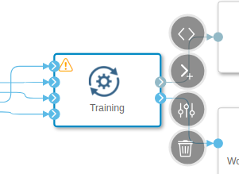
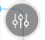
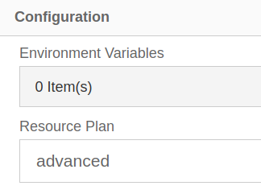
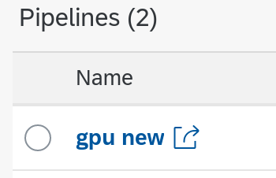
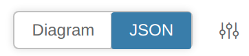
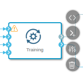
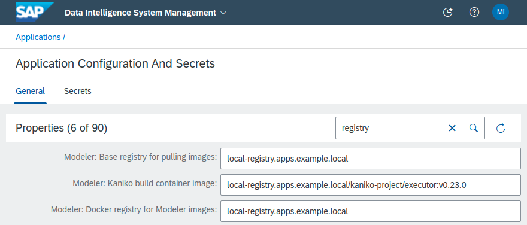
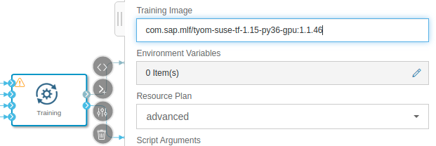
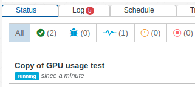
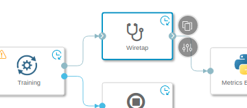

# GPU enablement for SDI on OCP

**Work in progress!!**

## Prerequisites

- OCP 4.6
- SAP Data Intelligence 3.1 or 3.2
- GPU equipped node(s)
    - make sure to use on of the support GPU model listed in the [SAP Note #2900587](https://launchpad.support.sap.com/#/notes/2900587)

## Node configuration

TODO

### Verification

- nodes are labeled by discovery pods with `nvidia.com/gpu.present=true`:

        # oc get nodes -l nvidia.com/gpu.present=true
        NAME       STATUS   ROLES        AGE    VERSION
        compute1   Ready    sdi,worker   364d   v1.19.0+b00ba52
        compute4   Ready    sdi,worker   342d   v1.19.0+b00ba52

- GPU operator installed and running on GPU enabled nodes, e.g.:

        # oc get pods -o wide -n gpu-operator-resources
        NAME                                       READY   STATUS      RESTARTS   AGE    IP            NODE       NOMINATED NODE   READINESS GATES
        gpu-feature-discovery-b45l7                1/1     Running     7          126d   10.129.4.21   compute4   <none>           <none>
        gpu-feature-discovery-xlcx9                1/1     Running     7          127d   10.130.2.9    compute1   <none>           <none>
        nvidia-container-toolkit-daemonset-8l29r   1/1     Running     0          126d   10.129.4.22   compute4   <none>           <none>
        nvidia-container-toolkit-daemonset-znhjv   1/1     Running     0          127d   10.130.2.3    compute1   <none>           <none>
        nvidia-dcgm-exporter-hwj7n                 1/1     Running     0          127d   10.130.2.11   compute1   <none>           <none>
        nvidia-dcgm-exporter-rltqr                 1/1     Running     0          126d   10.129.4.10   compute4   <none>           <none>
        nvidia-device-plugin-daemonset-ckbfb       1/1     Running     0          126d   10.129.4.20   compute4   <none>           <none>
        nvidia-device-plugin-daemonset-jdmb2       1/1     Running     0          127d   10.130.2.4    compute1   <none>           <none>
        nvidia-device-plugin-validation            0/1     Completed   0          72d    10.130.2.32   compute1   <none>           <none>
        nvidia-driver-daemonset-d4rzm              1/1     Running     0          26d    10.130.2.19   compute1   <none>           <none>
        nvidia-driver-daemonset-h88hn              1/1     Running     0          126d   10.129.4.8    compute4   <none>           <none>

## Configure a resource plan for GPU

### Get vctl binary

Follow [Download the SAP Data Intelligence System Management Command-Line Client Tool](https://help.sap.com/viewer/0b99871a1d994d2ea89598fe59d16cf9/3.1.latest/en-US/3de99bbe0c27487fb67f50dade7758c1.html).

### Configure resource plan

This examples assumes the commands are executed on a Linux managegement host where `jq` binary is installed.

1. Login to the Data Intelligence management service. In this example, for the API URL, we are using the URL of OpenShift's route:

        # # vctl login parameters: <vsystem-api-url> <tenant> <tenant-username>
        # ./vctl login https://vsystem-sdi.apps.<clustername>.<domainname>/ gpu-test miminar 
        Enter password: 
        Successfully logged in as "gpu-test/miminar"

2. List resource plans and store them in a json file:

        # ./vctl parameters get resourceplan.service.catalog | base64 -d | jq | tee resource-plans.orig.json
    
3. Choose one resource plan and extend it for GPU resource. In this example, we choose to modify the `advanced` resource plan.

    1. First set the desired arguments:

            # resourcePlanId=advanced
            # gpuLimit=1    # number of GPU units to request
            # nodeSelector=nvidia.com/gpu.present=true
            # # or alternatively to choose a specific GPU model:
            # nodeSelector=nvidia.com/gpu.present=true,nvidia.com/gpu.product=Tesla-V100-PCIE-32GB

    2. Then execute the following:

            # jq --arg resourcePlanId "$resourcePlanId" \
                 --arg nodeSelector "$nodeSelector" \
                 --arg gpuLimit "$gpuLimit" \
                '.resourcePlans |= [.[] |
                    if .resourcePlanId == $resourcePlanId then
                        . as $rp | [ $nodeSelector | split(",")[] |
                                     split("=") | {"key": .[0], "value": ((.[1] // "") | tostring)}
                                   ] | from_entries | . as $sel |
                        $rp | del(.nodeSelectors) |
                              .requestSpec.nodeSelectors |= $sel |
                              .requestSpec.gpu |= "" |
                              .limitSpec.gpu |= $gpuLimit
                    else
                        .
                    end
                ]' resource-plans.orig.json > resource-plans.new.json

    3. Please inspect the `resource-plans.new.json` and verify that it contains the desired nodeSelectors in the target resource plan, e.g.:

            # cat resource-plans.new.json
            ...
                {
                  "resourcePlanId": "advanced",
                  "resourcePlanDescription": "advanced",
                  "requestSpec": {
                    ...
                    "nodeSelectors": {
                        "nvidia.com/gpu.present": "true"
                    }
                  },
                  "limitSpec": {
                    ...
                  }
                }
            ...

    4. Optionally, modify the `requestSpec` and `limitSpec` `cpu` and `memory` attributes and save the file again.

    5. Update the resource plan in the SDI tenant:

              # ./vctl parameters set resourceplan.service.catalog "$(jq -c . resource-plans.new.json | base64 -w0)"

          Example output:

              Successfully set parameter "resourceplan.service.catalog" to "eyJyZXNvdXJj9...Cg=="

4. Start or re-start the Resource Plan Service.

    1. Go to the System Management, Applications tab.
    2. Find the "Resource Plan Service".
    3. If it is running, re-start it, otherwise start it.
    4. Ensure that the "started" notification appear or its status becomes "ready".

## Verify the GPU unit with an example pipeline

1. Please download the [./graph.json](graph.json) file.
2. Open Data Intelligence Modeler and click on the Import Graph icon . A new tab called "GPU usage test" will open.
3. Click on the "Training" operator and choose "Open Configuration".

    

    The "Open Configuration" icon: 

4. Choose your configured resource plan in the "Resource Plan" combobox.

    

5. Click "Save". In this example it is assumed the graph is named "GPU usage".
6. Open ML Scenario Manager, create or open a scenario.
7. In there, create a new pipeline from the "Blank" Template. And click on the created pipeline. It will open in the Modeler.

    

8. Back in the modeler, open the imported "GPU usage" graph in another tab and switch to JSON view.

    

9. Select the whole JSON content and copy it.
10. Still in the modeler, return to the blank template tab opened from the Scenario Manager, switch to JSON view and paste the JSON content.
11. Save the graph.
12. You can close the imported "GPU usage" tab in the Modeler now.

### Update the example GPU pipeline

1. Click on the Training operator and open its configuration.

    

2. Copy the "Training Image" name and verify it can be pulled from the local registry.

    1. If you don't know the image registry name, locate it in the Application Configuration in the System Management:

        

    2. Inspect the pull spec:

            # # the URL is of format: docker://<registry-name>/<image-name>:<image-tag>
            # skopeo inspect docker://local-registry.apps.example.local/com.sap.mlf/tyom-suse-tf-1.15-py36-gpu:1.1.52

    3. If a JSON is displayed, everything is alright. You can skip the rest of this section.

    4. Otherwise, determine the latest tag of the "com.sap.mlf/tyom-suse-tf-1.15-py36-gpu" image in your registry. If your registry supports `tags/list` endpoint, you can determine it like this:

            # # URL is of format: https://<registry-name>/v2/<image-name>/tags/list
            # curl --silent \
                https://local-registry.apps.example.local/v2/com.sap.mlf/tyom-suse-tf-1.15-py36-gpu/tags/list | \
                jq -r  '.tags[]' | sort -V

        Example output:

            1.1.39
            1.1.46

    5. Take the latest tag available and update the Trainig Image field with it.

        
        
3. Save the graph.

### Run the pipelient and verify it

1. Run the example pipeline either from the Modeler or from the ML Scenario Manager.

2. Wait until graph becomes Running and Click on it.

    

3. Open the wiretap of the running graph.

    

4. Verify that the pipeline succeeds, in the Wiretap, you should be able to see output like this:

        [2021-09-28 14:27:38,000] Job submitted successfully with UUID 5838f7be-7726-4e32-8286-c79a64e77a15
        [2021-09-28 14:27:59,000] 2021-09-28 14:27:55 "Testing gpu"
        [2021-09-28 14:27:59,000] 2021-09-28 14:27:55 "Calculation COmplete"
        [2021-09-28 14:27:59,000] 2021-09-28 14:27:55 "Tensor("MatMul:0", shape=(2, 2), dtype=float32, device=/device:GPU:0)"
        [2021-09-28 14:27:59,000] 2021-09-28 14:27:55 "Is TF built with CUDA?"
        [2021-09-28 14:27:59,000] 2021-09-28 14:27:55 "True"
        [2021-09-28 14:27:59,000] 2021-09-28 14:27:55 "Testing complete"
        [2021-09-28 14:27:59,000] 2021-09-28 14:27:55 "Training completed with exit code 0"
